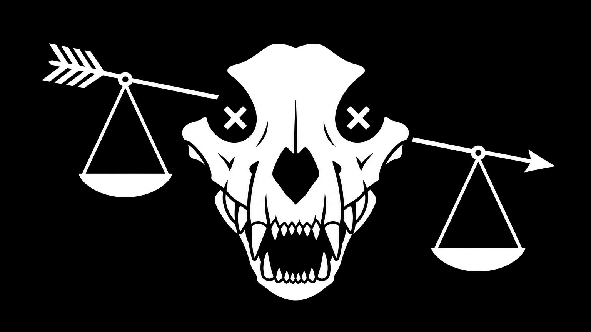

## MeiosisKMZ

  

Flag of the Kaos Mainframe Zone hackerspace

Hello, I am Meiosis, I speak fluently English and French.

My name comes from biology: *meiosis*, a process of division and transformation. I like the parallel — in cybersecurity, I break systems down, understand their structure, and move through them with precision.

KMZ stands for Kaos Mainframe Zone. It’s the name of my server and hackerspace, inspired by the concept of a DMZ — our first real access point to a server environment at school.

I am currently studying networking and telecommunications with a specialization in cybersecurity.

My goal is to work in military cybersecurity, focusing on ethical hacking and system defense.

I make some apps for the FlipperZero that you may want to check out:
* [PMRScan](https://github.com/MeiosisKMZ/pmrscan) scan PMR446 channels listening for activity with the FlipperZero.
* [FurNFC](https://github.com/MeiosisKMZ/FurNFC) Simple Flipper Zero app to read hex and decode it as ascii from Mifare NFC card.
* [FlipLegoTrain](https://github.com/MeiosisKMZ/fliplegotrain) Use your FlipperZero as a controller for your Lego Train.

I also do some other computer/PoC stuff:
* [TelWare](https://github.com/MeiosisKMZ/TelWare) DoS inducing malware for vulnerable printers.
